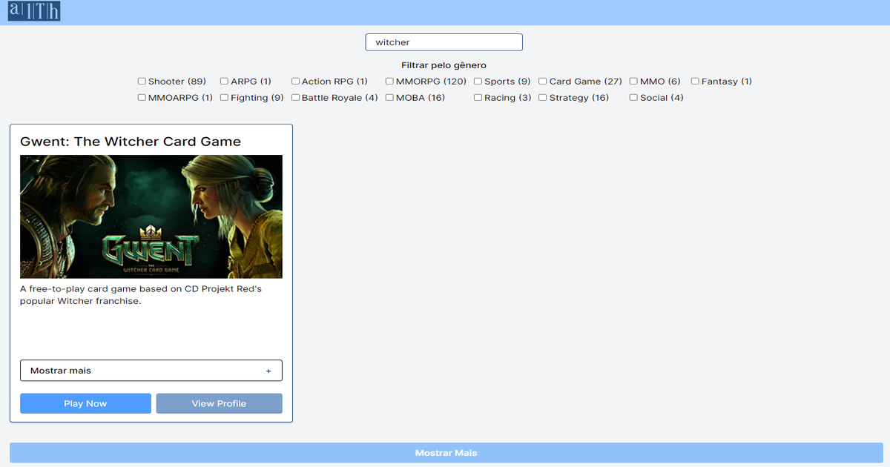
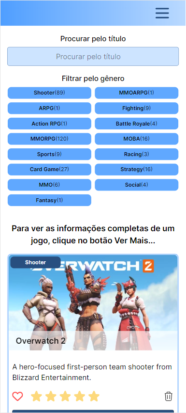
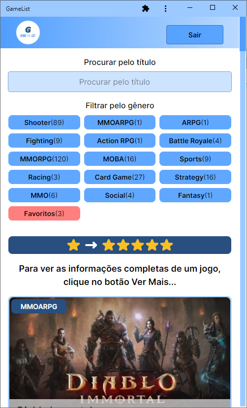
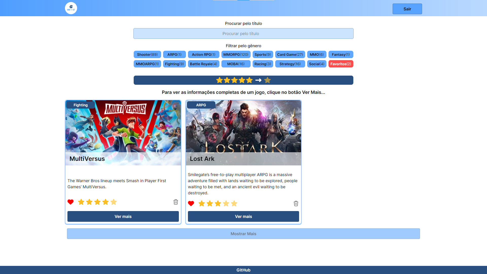
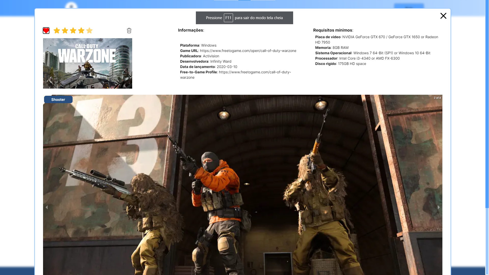
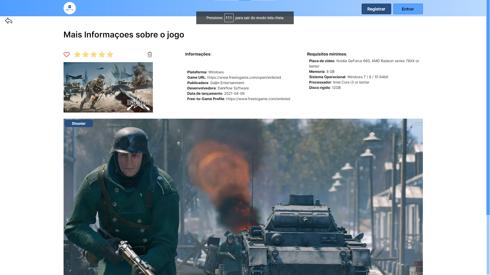
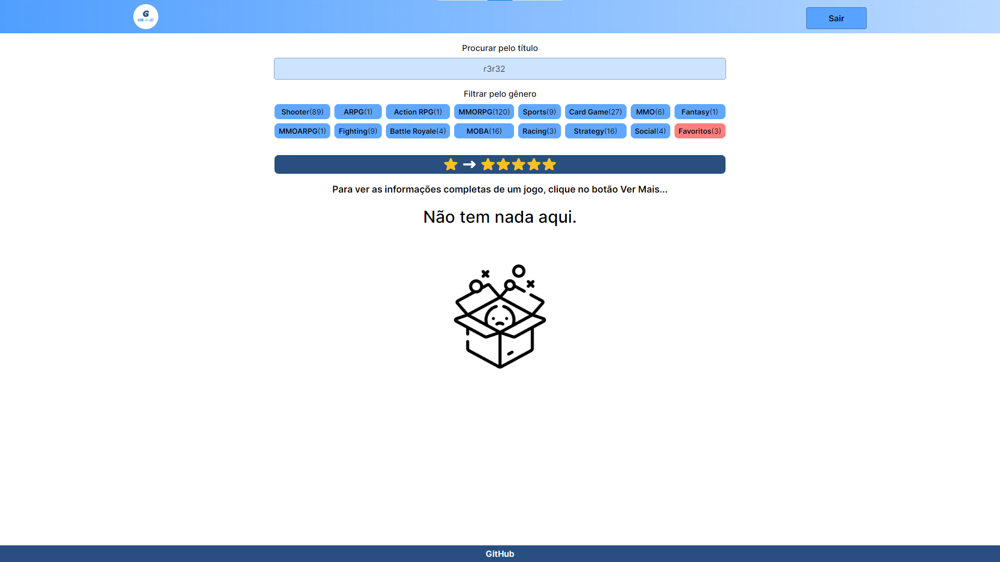
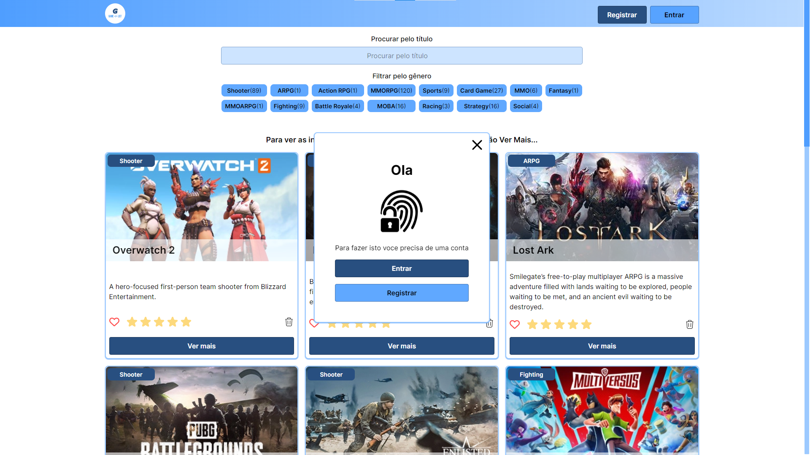
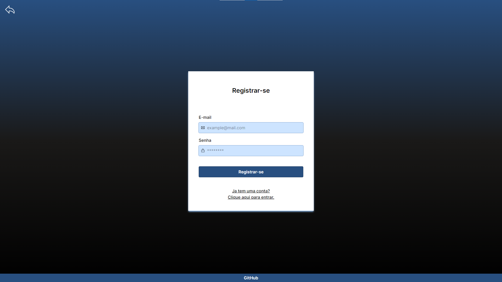
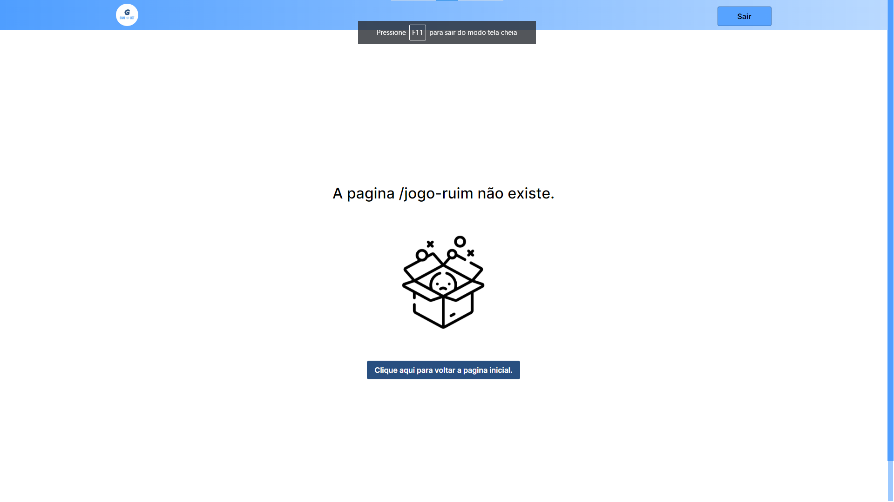

# Projeto de Estágio Frontend React
## Descrição

Este projeto é um projeto de estágio frontend que utiliza o Firebase para autenticação por email/senha. Permite que os usuários favoritem jogos e salvem essas informações no Firebase. Além disso, possui recursos de busca, filtro e avaliação dos jogos.
## Funcionalidades

- Autenticação de usuários por email/senha usando Firebase
- Favoritar jogos
- Salvar jogos favoritos no Firebase
- Botão "Favoritos" para exibir apenas os jogos favoritados
- Busca e filtro de jogos favoritos
- Avaliação de jogos com até 5 estrelas
- Interface com ícones indicando favoritos e avaliações
## *Lista de jogos*

Mobile

Versão PWA

### *Favoritos*

### *Modal da pagina do jogo*

### *pagina do jogo*

### *Lista de jogos vazia*

### *Aviso de necessidade de autenticação*

### *Modal de autenticação*

### *Pagina de autenticação*

### *Pagina 404*

## Instalação

1. Clone o repositório: `git clone https://github.com/seu-usuario/seu-projeto.git`
2. Navegue até o diretório do projeto: `cd seu-projeto`
3. Instale as dependências: `npm install`

## Uso

1. Execute o comando: `npm run build`
2. Execute o comando: `npm start`
3. Acesse o aplicativo em: `http://localhost:3000`
