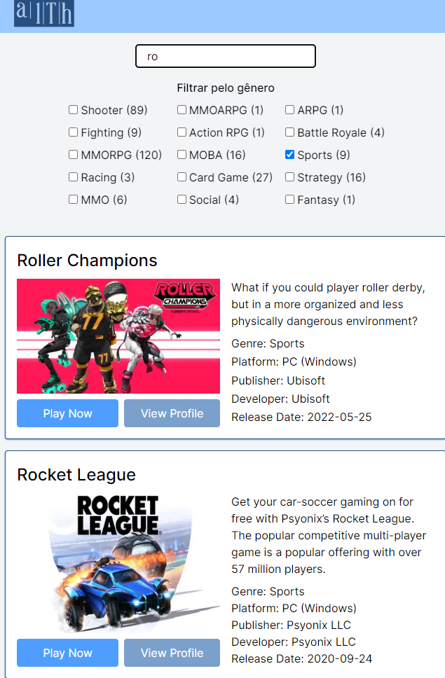

# Projeto de Estágio Frontend React

# Seja bem vindo ao nosso processo de seleção!

Precisamos implementar o frontend para apresentar uma lista de jogos, que será fornecida por uma API.

Porém, essa API é estranha… não tem documentação, dá uns erros, ora responde, ora falha, pede um `header`👀 lá... mas, temos certeza que você conseguirá ainda assim fazer um projeto incrível!

🧨 Lidar com os erros, é especialmente importante neste projeto. Você verá quando começar.

## Requisitos funcionais

A url base da API é [https://games-test-api-81e9fb0d564a.herokuapp.com/api/](https://games-test-api-81e9fb0d564a.herokuapp.com/api/)

* O projeto deve ser feito usando React ou Next.JS
* Obter a lista de jogos em `/data`
* Apresentar um loader enquanto os dados são obtidos
* Apresentar os jogos em três colunas (no computador)
* Em cada card apresentar o título e imagem pelo ao menos
* Lidar com a responsividade, para que fique bem apresentado no computador, tablets ou celular
* Quando a API retornar o `status code` 500, 502, 503, 504, 507, 508 ou 509 apresentar ao usuário `O servidor fahou em responder, tente recarregar a página`
* Caso a API retorne outros erros, apresentar `O servidor não conseguirá responder por agora, tente voltar novamente mais tarde`
* Ao realizar uma chamada, não esperar mais que 5 segundos pelo retorno. Se os dados demorarem mais de 5 segundos para retornar apresentar `O servidor demorou para responder, tente mais tarde`
* Sempre que apresentar uma mensagem para o usuário, ou tiver os dados em mãos para apresentar, ocultar o loader
* Incluir um campo de busca, que permite localizar jogos pelo título, com busca case insensitive
* Uma vez que tenha os dados em mãos, veja quais `genre` foram retornados e permita ao usuário selecionar um deles, e então filtre para exibir apenas jogos do gênero selecionado

## Algumas dicas e informações extras

* É bom saber usar o  **DevTools** , a API pode pedir algo que não foi falado acima
* É bom saber o que é `header`, e como se envia um dado via `header`
* Use TypeScript se já tiver prática com ele, senão, faça com JavaScript mesmo
* Adicione um ou dois prints do seu projeto no readme do seu repositório
* Se quiser ganhar pontos extras, publique o projeto online para facilitar nossa verificação
* Se quiser usar biblioteca visual, use, só não pegue um projeto pronto e modifique
* A beleza importa
* O tal `dev-email-address` pode ser qualquer email válido, não precisa ser exatamente o seu (se não quiser ele público no seu repositório)

